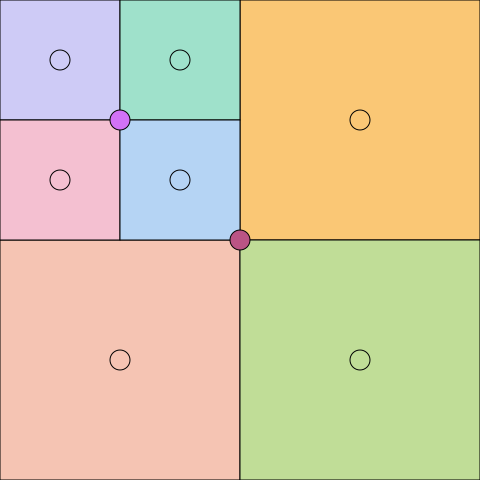
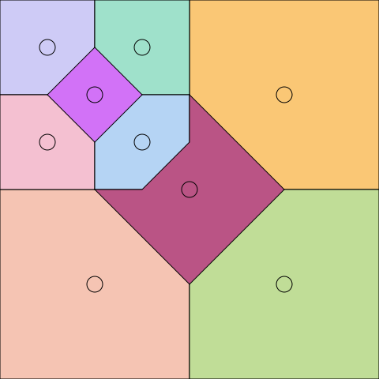

# README

drawing the metabrot set, caching samples in a quadtree. [some](https://github.com/JosieElliston/fractal_egui) [previous](https://github.com/JosieElliston/fractal_explorer) iterations. [video](https://youtu.be/wz_QIwfb6oA) of looking around. you may find the [report](report.md) enlightening.

## controls

- pan/zoom with mouse
- various controls in info menu, descriptions and keybinds shown on hover

<!-- ## implementation

### sampling

### caching/quadtree

#### simplest

TODO: present sync first
present by optimization (in some order):
- concurrency
- allocator + reclamation
- color pruning / texture caching/reuse
- retire-select pruning (doesn't depend on window so it's simpler)
- refine-select pruning

```rs
struct Node {
    color: Option<Color>,
    children: Option<[Box<Node>; 4]>,
}

struct Tree {
    root: Node,
}

impl Tree {
    fn refine(&mut self) -> Complex { ... }
    fn insert(&mut self, z0: Complex, color: Color) { ... }
    fn color(&self, z0: Complex) -> Color { ... }
}
```

#### pruning

refine is O(n) because we need to find the shallowest leaf.
if we store the distance to nearest/shallowest descendant leaf at each node,

#### concurrency

#### reclamation / block allocator -->
<!-- 
## 2026-05-29 writeup

have f: [0, 1]^2 -> Color.
(note this is fixed across time).
we want to render f to the screen (pixel grid), with panning and zooming .
naively (without antialiasing), we sample f at the pixel centers
insert mermaid visualization.

but f is expensive, so we want to cache samples.

bad version: quadtree where only leafs store samples.
leafs store the sample at their center.
bad because this discards a node's samples when it gets split.

bad version: quadtree with internal nodes storing samples,
color-of-point is the color of the nearest sample.
bad because finding the nearest sample is complicated.





good version: quadtree with internal nodes storing samples, color-of-point with following the path down to the leaf.

so that's the definition of the color at a point.
for the color of a pixel,
currently i just take the color of a pixels center,
but in the future i hope to do some antialiasing,
defined as the average color of the points contained in the pixel.

other tree operations:
refine
insert
color
retire
free

optimizations
min/max height
render timestamp

concurrency -->
