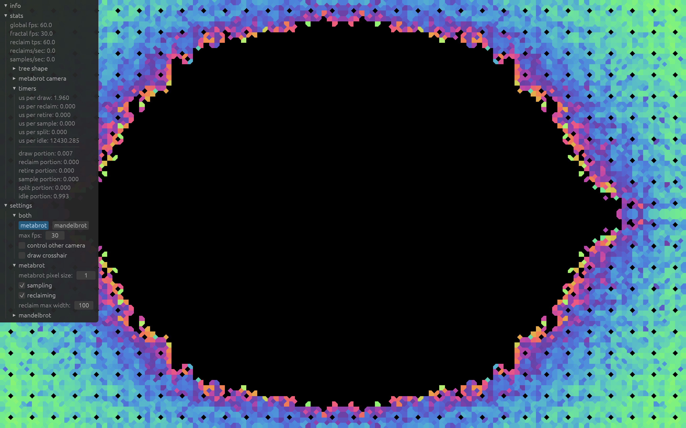
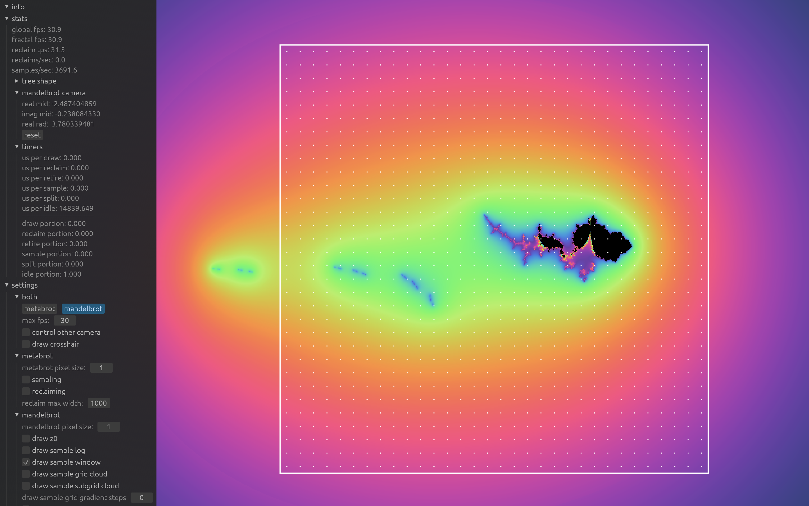
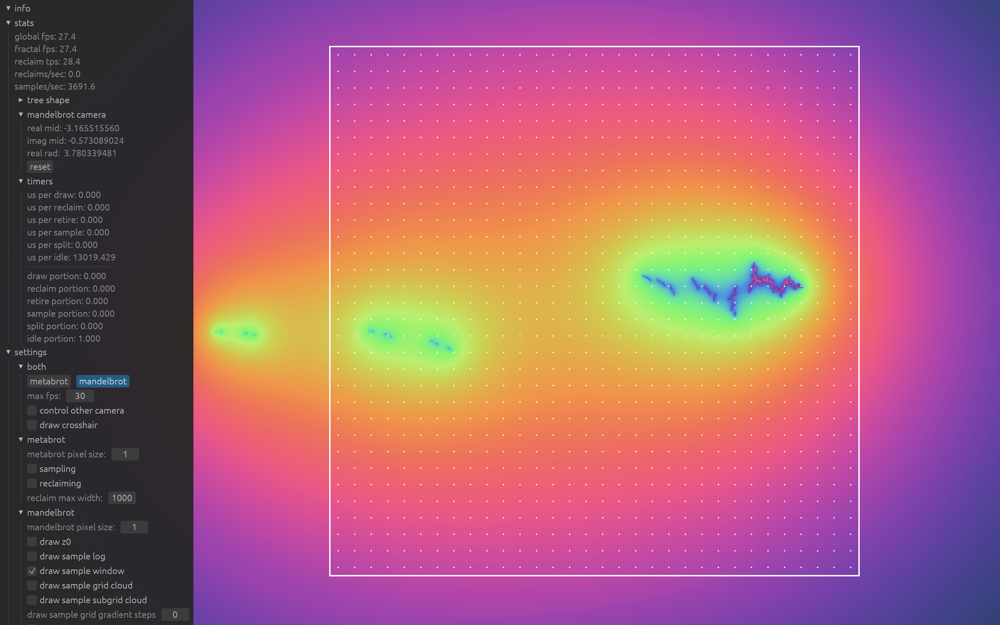
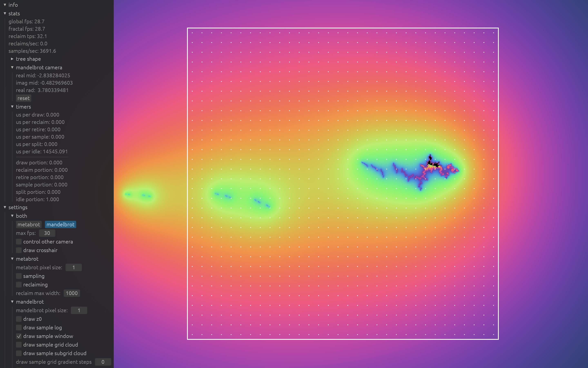

# report

## intro

I wanted to render a certain fractal, defined in [sampling](#sampling), which I selected largely for being expensive over being mathematically interesting. Naive rendering is embarrassingly parallel (ie all pixels can be computed independently of each other), but is too slow for real time interaction: my prior best attempts could render a high resolution image in ~30 seconds (using the gpu).

The next step was caching samples across frames. We must somehow store points and their color such that we can run queries on what we should color a pixel, select new points to sample, and insert these new points and their samples. A difficulty with coloring is that we cannot guarantee that a pixel will contain any samples. We shouldn't merely use points on pixel centers, as these will typically get invalidated after panning/zooming. I chose to use a quadtree, where each nodes stores the sample at the center of its region/domain, and internal nodes have four equally sized children.

I got a synchronous implementation working at low resolution, framerate, and sampling rate, which is where this program was when I proposed this project. For a4, I parallelized the tree, and it now runs at 60 fps with ~100x the sampling rate. I used AI tab-competition, and occasionally used chat to find bugs, which ever worked.

## results

I recorded a [video](https://youtu.be/wz_QIwfb6oA) of looking around the fractal.

Quadtree with fine nodes.

Quadtree with medium nodes.

Quadtree with coarse nodes.

Quadtree where I zoomed in on the right, froze sampling and reclamation, and zoomed out.

## loop

We have worker threads that compute samples and perform tree operations, and a main thread that manages them.

- workers have a main loop, where they go though operations in a static order.
    - this order is chosen to not deadlock/livelock.
    - stuff like
        - rendering is highest priority, so the main thread can progress.
        - we don't get new nodes to sample before the queue is emptied.
        - we try to free nodes before retiring more.
- the refine and insert operations are fully independent between threads.
- but rendering requires more synchronization.
    - main thread rendering
        - resize the texture if needed
        - clears begin_count and finish_count
        - does other stuff
        - blocks until finish_count matches the texture height
        - give the texture to egui
    - worker threads rendering
        - check if begin_count is less than height, do a fetch_and_add, check again that its less than height
        - render a line to the texture, each pixel of which is independent.
        - increment the finish_count
- reclaiming also requires more synchronization, described later.

## tree

Each nodes stores

- The point at which the node is centered, which is the point we need to sample to get the node's color. (This is actually implicit in the structure of the tree, but it's convenient to have.)
- The side length of the node. Together with the center, this defines the node's domain. All of our descendants' domains will be a subset of this domain.
- The parent, which is convenient for some operations. (But isn't actually necessary for any, and I should remove it.)
- The optional left-child pointer. Children are allocated in groups of four, and we don't allow non-full internal nodes, so this fully determines all our children. (We don't store a right-sibling pointer.)
- The optional color. The color starts empty, then gets set once a worker samples the node's center, and never changes again.
- The distance to the closest descendant leaf. 0 if the node is a leaf, else 1 + min(c.min_distance for c in children). This is for pruning when selecting a node to split.
- The distance to the farthest descendant leaf. 0 if the node is a leaf, else 1 + max(c.max_distance for c in children). This is for pruning when selecting a node to refine.
- The frame count when this node's color or any of its descendants' colors was updated/filled. This is for pruning when getting the color of a pixel. <!-- So the root node will typically have the current frame count (because any node's color getting filled will update the root's timestamp), leafs outside the current viewing window will have a old timestamp (because we don't split nodes outside the window), and nodes intersecting the current viewing window will get updated as leafs intersecting the window get split. -->

The domain and parent aren't atomic because they're constant over the lifetime of the node.

The left-child pointer is atomic and is the primary synchronization object.

The color is atomic because it changes over the lifetime of a node.

Operations on the pruning fields (min-distance, max-distance, timestamp) are atomic because we atomic load and fetch_min/fetch_max. It seems hard/slow to have require updates to appear to happen to the entire tree atomically, so I instead relax the semantics and instead require eventual up-to-dateness. If we prune too conservatively, that's fine. If we prune too aggressively, we have that a future operation wouldn't prune.

The timestamp is atomic because we need atomic load and fetch_max. Operations on a node's timestamp only involve a single atomic, so operations can be relaxed.

The distance fields are atomic because we need atomic load and fetch_min/fetch_max. I haven't figured out exactly how relaxed these operations can be, or the exact semantics, and believe that it's currently incorrect which is causing the occasional 100x slowdown in refinement and reclamation.

## coloring

We have a pixel, and we want to find what color it should be.

- def color of a pixel (bad):
    - get the center of the pixel, nothing else about the pixel matters..
    - find the leaf the center is in.
    - return the leafs color.
- this is bad because it doesn't use the colors of internal nodes.
- def color of a pixel:
    - get the center of the pixel, nothing else about the pixel matters.
    - follow the path down to the leaf the center is in.
    - take the color of the node whose center is closest to the pixel center.
- we can optimize this.
    - if we're not moving the camera, very little of the image is changing; it would be nice to reuse most of the texture across frames.
    - the color of a pixel needs an update only when you insert a sample or reclaim a node.
    - we introduce a global render clock.
    - the main thread updates the global timestamp every frame, and worker threads fetch it at the start of operations.
    - so we have nodes store a timestamp of when it or any of its descendants had their color changed.
    - (so eg the root will probably have a timestamp of almost exactly now, because any update wil update the root)
    - when going down the path to the leaf, if we ever encounter a timestamp that's old enough, we exit early and don't update the texture.
    - note that (contrary to how i've drawn it) we can't have the timestamp updates for inserting a sample happen instantly, so we  sometimes return early even though the node has been colored. this just means the texture will be slightly stale, which is fine.
- we can optimize this.
    - we're still doing a lot of work per pixel.
    - it would be nice to prove a region of pixels haven't changed.
    - we explore nodes that intersect the region,
        - if a node is definitely good, we don't explore its children.
        - for a node to be definitely good, it simply needs a old timestamp.
        - if a node is definitely bad, we fail.
        - for a node to be definitely bad, it must be a leaf.
    - (i do this for regions that are lines because i render line by line)

## allocation

- **DRAW**
    - struct Alloc { head: Atomic<*Block> (: 1 word) }
    <!-- - struct Block { mem: [Node; 63], prev: Atomic<*Block>, len: usize  } -->
    - struct Block { mem: [Node; 63], len: usize } (don't draw prev)
    - draw these as boxes with members (as opposed to member list (which i might never use))
    - draw two `Block`s, draw `Alloc` underneath.
- 64x64 byte blocks, of which one cache line is reserved for metadata.
- note that i don't every free `Block`s, or even have a shared free-list for reclaimed nodes.
- note that nodes aren't atomic, only their fields.
- the handle i give out is just a pointer, touches are just looking though the pointer to the fields.
- fn alloc
    - head_ptr := alloc.head.load()
    - i := head_ptr.len.fetch_add(1)
    - if i < CAPACITY: return &head_ptr.mem[i]
    - else we need to append a block
    - **DRAW**: doing this
    - new_block_ptr := global_alloc(block) // also check the thread-local cache
    - alloc.head.cas(head_ptr, new_block_ptr)
    - if the cas failed, put new_block_ptr into thread-local cache
    - but in both cases, *someone* appended a block, so we go to the top of alloc and retry.
- mem ordering: i think that they can all be relaxed, but i'm not sure
- why does len need to be stored in each block and not just in alloc?
    - (the len going out of bounds makes me uncomfortable)
    - in the case where we realloc, i := alloc.len.load() is too large so we need a new block.
    - so we do the realloc, then do head_ptr := alloc.head.load(), and return `&head_ptr.mem[i % BLOCK_CAP]`.
    - but this block isn't guaranteed to be immediate next block.
    - we could have gone to sleep, and many blocks could have been appended, and now we have two logically different pointers that are actually the same.

## reclamation

- i have that handles don't live across subroutine calls, except for ones in the nursing_home (and the root)
- epoch reclamation: why?
    - i already had a clock for the color pruning.
    - tho i ended up using a disjoint clock for reclamation.
    - this allow for invisible readers.
    - in particular, the handle can just be the pointer.
- clock
    - **DRAW**: main clock above, array of four thread clocks below, tally marks inside
    - there's a central clock,
        threads read it and publish the value they last read,
        the central clock can only tick if it sees that everyone is fully up to date.
    - this maintains that threads can be at most one tick out of sync.
    - (attribution: this was the first thing i thought of and didn't look farther.)
    - in fact, we tick once per frame.
    - (ticking slower means that the buffers will grow larger,
        not that we can only reclaim one node per tick.)
- epoch reclamation: how?
    - **DRAW**: tree triangle, bottom nodes ☐ > ☐☐☐☐
    - note that we're reclaiming the children, not the node itself.
    - erase the child pointer, push the children/siblings onto a queue with the timestamp.
    - after a few ticks, free the siblings.
- fn retire
    - select a node, which should be internal
    - do an atomic get-and-set on the child pointer to clear it
    - if the child pointer was `None`, someone else got there first, whatever
    - if it wasn't `None`, we put the siblings into the thread-local nursing home.
    - (we change to calling them siblings at this point)
    - we are now responsible for freeing the siblings after some grace period.
- how long a grace period? we need to wait two ticks from the end (or three ticks from the start).
- lower bound on grace period
    - **DRAW**: timeline
        - ~~         X |       |             X                          ~~
        - free:    └────────c─┘                 └─f─┘
        - touch:        └─r─────────────────────────x─┘
    - suppose i'm retiring, and it's very late in the tick.
    - i select a node, clear its child pointer, and exit.
    - i find out the tick has happened, so i publish my ack and free the siblings.
    - but this allows for a use-after-free:
        there's nothing stopping a thread
        from having looked at the child pointer before i cleared it,
        push the children's handles onto a bfs queue,
        and then do a use-after-free once it gets around to them.
- upper bound proof
    - first, the previous example doesn't disprove this.
        - **DRAW**: move └─f─┘ to the next tick.
        - we can't have that the touching subroutine lives long enough for the tick to happen, because the tick happening is dependent on the death of the the subroutine.
    <!-- - we want to prove that between retiring and freeing,
        all threads have ever not been inside a subroutine
        (because handles don't persist across subroutine calls). -->
    - what do we know?
        - acking a tick proves to the main thread that you aren't in a subroutine.
        - seeing a tick proves to you that every thread has acked the previous tick.
    - what we we want?
        - we need an entire tick to elapse during which no one can look through the child pointer (bc it's None).
    - the tick after exiting retire is the start of this period, and the next tick ends it.
- ok so we've waited the grace period, can we now free the nodes?
    - are we sure no one has handles to them?
        - only reclamation stores handles across acks
        - we get our handles from an atomic get-and-set, so we're confident that no one has pointers to the siblings
    - but what about the siblings' children?
        - my picture is misleading, we can't guarantee that the picture look like ☐ > ☐☐☐☐
            - like we could try to select a node with height one, but we can't guarantee that it remains height one, that's like the whole problem
        - **DRAW**: tree triangle, bottom nodes ☐ > ☐☐☐☐ > ☐☐☐☐
        - obviously we shouldn't leak them.
        - we can just retire them, put them in the nursing home, and wait the grace period.
        - but do we actually need to wait or can we free them now?
        - it turns out we can!
            - the thing we're worried about is a double free.
            <!-- - we have exclusive handles to the nodes we carry across ticks. -->
            - any left_sibling in a free-list must have already cleared its parent's child pointer.
            - so, if we can look through a child pointer, the children must not be in a free list.
            - therefore, we can recursively free the (accessible) children now.
            - TODO: better proof
    - so after you've stored their child pointers elsewhere (or just completely finished freeing their children), you can free the siblings, declare that reading them is UB, push them onto your free-list
- i have ideas about how to put them back into the global free-list (have each block store a bitset of free nodes), but right now they're put into a thread-local free-list for reuse before you request an allocation from the global free-list. currently, you can get something like one reclaims nodes and doesn't give them away, but that's unlikely.

## refine

- **DRAW**: argmax_{leaf} depth st it intersects the window and wouldn't get reclaimed.
- we want split the shallowest leaf that intersect the window (and wouldn't get reclaimed).
- we first find the depth of such leaves,
- then iterate over such leaves.
- for each leaf:
    - prep the prospective children.
    - try to swap in the new child pointer.
    - if we succeed, return the points we need to sample.
    - if we fail, try the next leaf.
    - if we fail to find any leaf, put the siblings back into the free-list and return.
- the slow part is finding such leaves, which we can optimize.
    - each node store min_height: distance to the closest descendant leaf
    - we use this in the searches to prune internal nodes that are guaranteed to not contain a shallowest leaf.
    - (we also do something similar during retirement)

## insert

- we have a point and it's color.
- follow the child-pointers down until the node's domain's center matches the point.
- insert the color into the node.

## sampling

z_0 where we correctly identified that it's inside the metabrot set.

z_0 where we correctly identified that it's outside the metabrot set.

z_0 where we mistakenly think that it's outside the metabrot set.

- slide: the quadratic map
    - we're interested in iterating the function z^2 + c
    - iterating meaning z\_{n+1} = z_n^2 + c
    - if we instead iterated c, we'll get something much less interesting
    - embed gif of varying c with lines between iterations (desmos)
- slide: mandelbrot set
    - note how some initial values for c stay bounded, while others diverge
    - a c value is inside the mandelbrot set if it stays bounded, and color it black
    - and otherwise color the c value based on how quickly it diverges
    - embed gif of varying c with lines between iterations (desmos) on top of the mandelbrot set
        - note that screen space is the c plane
- slide: z_0 != 0
    - you'll notice i never specified a base case for the function we're iterating
    - the previous slide used z_0 = 0, which is natural choice
    - but we can in fact pick other values
    - there are various things you might observe about these other mandelbrots, but what we care about is that some values of z_0 have area, while other don't
    - embed gif of the mandelbrot set with varying z_0 (desmos)
- slide: metabrot
    - well, lets draw this
    - instead of screen space being the c plane, screen space will be the z_0 plane
    - for each pixel (ie z_0 value), we'll color it black if the corresponding mandelbrot has area, otherwise we'll color it based on the maximum depth any point achieved before escaping
    - note that if you do a meta-julia set, you just get the mandelbrot set
